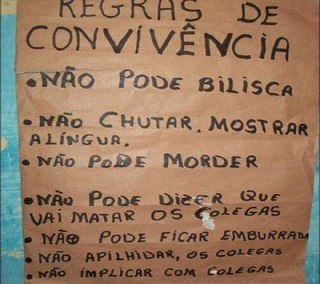

# Brasucas Svenska
## Comunidade para trocar conhecimento a quem quer migrar ou está na Suécia

Antes de qualquer coisa, leia as regras básicas da imagem e também as regras a seguir dela:

  

Agora que temos cada vez mais gente no grupo, é bom deixar claro uma coisa se não já ficou: não aceitamos bolsonaristas. Qualquer tipo de discrimicao com lgtbq+, raça, gênero toma kick também. Este é um grupo de ajuda para quem tá imigrando para Suécia. 

# Dúvidas frequentes

- Onde eu posso procurar casas para alugar?

Sites a seguir para fazer suas buscas. Nem todas as descrições das casas estão em inglês uma boa parte está em sueco, então já entra no translate. Tome cuidado com as datas de fim de contrato, é comum na Suécia os aluguéis não durarem muito tempo, o mais comum é ficar por 1 ano.

  - https://www.residensportalen.com
  - https://bostad.blocket.se
  - https://www.beresidentsweden.com
  - https://en.qasa.se